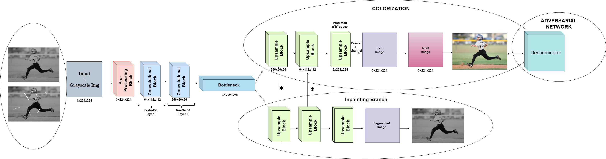
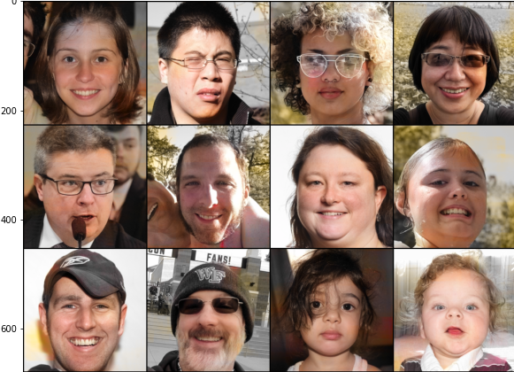
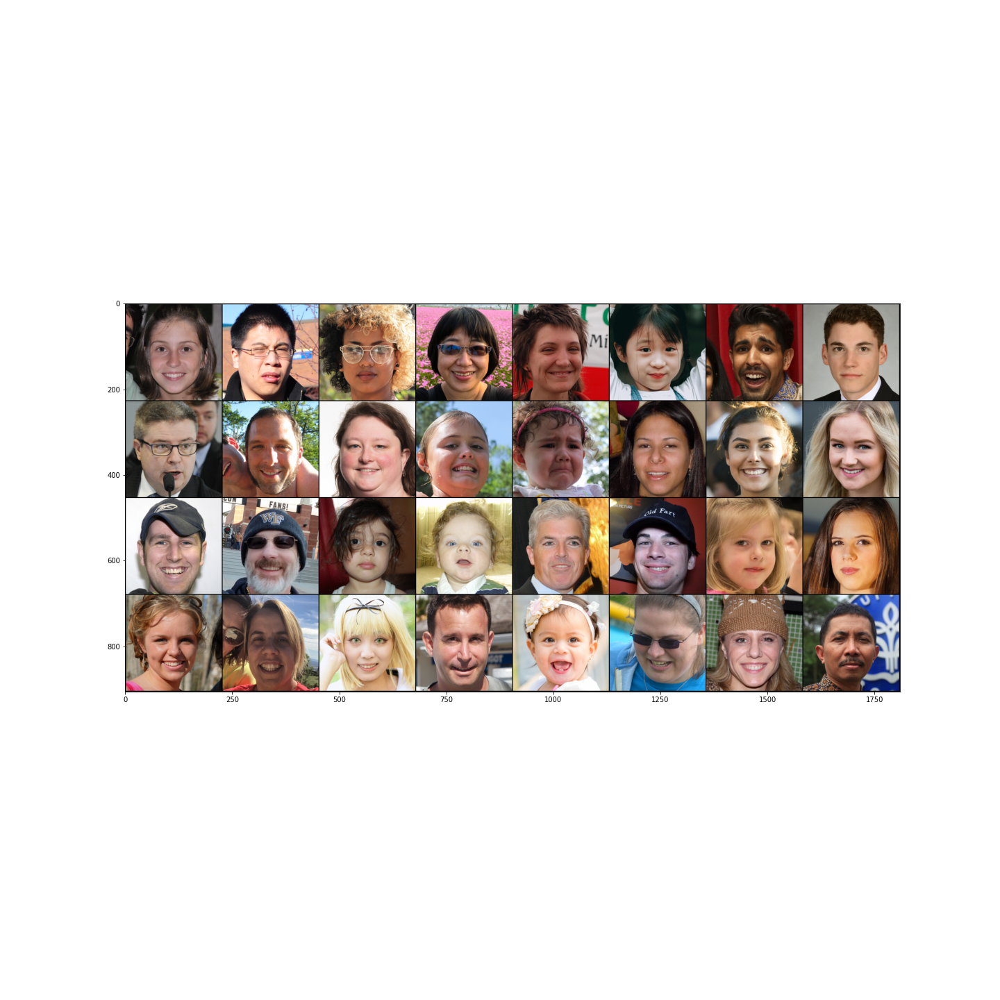

# Image-Colorization
This is an ongoing project and is to be updated.

# Baseline Architecture
We have made a simple U-Net architecture employing first two layers of ResNet50 network(pre-trained on imagenet) as Encoder.
 
In the decoder section we have used Upsampling layers to avoid checkerboard artifacts.
 
 

# BASELINE Results
These are the results we have obtained from our basline model on the Flicker Faces Dataset. As it is evident the architecture is capable of modeling decent color aesthetics while witholding quality of image.
 
 

<h3 align="center"> Predicted Colors </h3>

<h3 align="center"> True Colors </h3>

