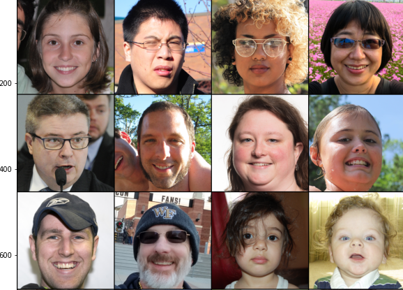

# Image-Colorization
We propose a fully convolutional approach, making use of ResNet50 layers as encoder and nearest neighbour up sampling in decoder, we train a branch parallel to our decoder for inpainting task on grayscale images and mix the features of inpainting branch with colorization decoder. We also make use of Adversarial training by employing a discriminator for our colorization branch.

# Architecture
We have made a simple U-Net architecture employing first two layers of ResNet50 network(pre-trained on imagenet) as Encoder.
 
In the decoder section we have used Upsampling layers to avoid checkerboard artifacts.
 
 

# Results
These are the results we have obtained from our model on the Flicker Faces Dataset. As it is evident the architecture is capable of modeling decent color aesthetics while witholding quality of image.
 
 

<h3 align="center"> Predicted Colors </h3>

<h3 align="center"> True Colors </h3>

# Conclusion

The results are satisfactory given the resources at hand, we have achieved improvement in color prediction from our baseline model by adopting adversarial training.
